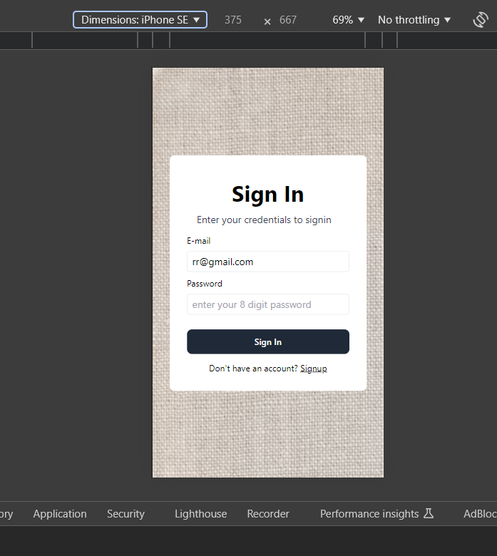
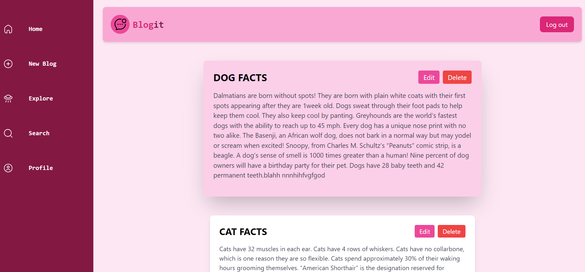
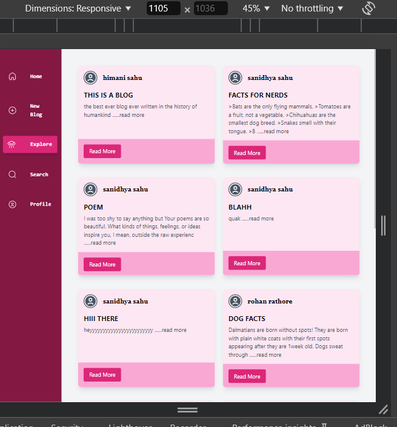
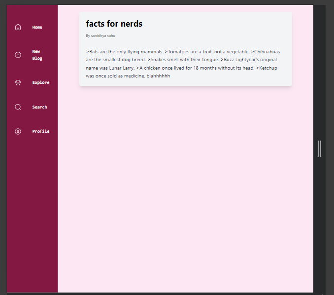
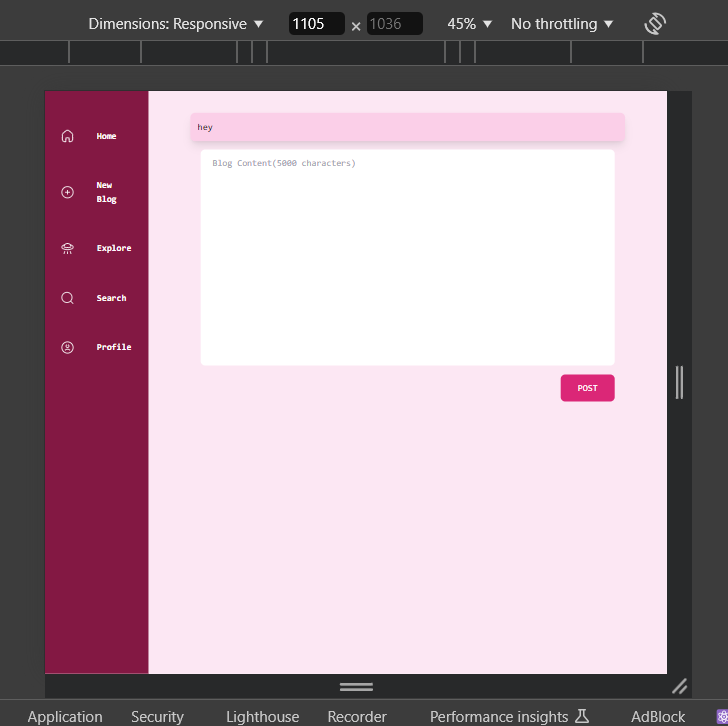
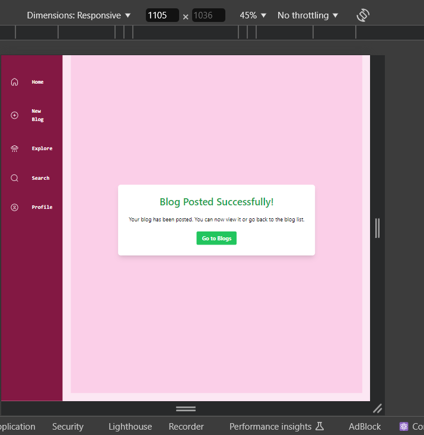
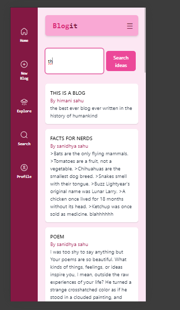

## BlogIt

A blogging website built with the MERN stack (MongoDB, Express.js, React, Node.js).

## Introduction

BlogIt is a full-stack blogging platform . It features a user-friendly interface and a robust backend to manage blog data.

## 📷 Screenshots

### signin/signup Page

## Features

• User authentication (signup/login)
• Responsive design:
• Blog Management: Easily create, update, and delete your blog posts.
• User Profiles: View and manage personal information and blogs.

## Technologies

## Frontend

- React, Tailwind CSS

## Backend

• Node.js: Efficient, scalable server-side runtime.
• Express.js: Minimalist framework for building robust APIs.
• MongoDB: Flexible, document-based database for storing blog data.
• Mongoose: ODM (Object Data Modeling) library for MongoDB and Node.js.
• JWT (JSON Web Tokens): Secure authentication method for user sessions.
• Zod: Schema-based validation to ensure data integrity.

## Connect

Check out my project video on X.com for a quick overview:

[Watch the video on X](https://x.com/HimaniSahu67644/status/1829530551507943448)
